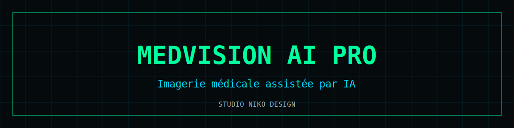

# MedVision AI Pro

  

Plateforme web d'**imagerie médicale assistée par intelligence artificielle** — application single-file, installable en PWA, données traitées localement.

**Démo** : [medvisionproai.vercel.app](https://medvisionproai.vercel.app) · [Pages](https://nikoju1977.github.io/medicalvisionproai/)

## Fonctionnalités

- 🧠 Système **multi-agents IA** spécialisés par domaine d'analyse
- 🩻 **Lecteur DICOM** intégré au navigateur
- 🔐 Authentification par PIN, stockage local chiffré (IndexedDB)
- 📊 Export de rapports (PPTX)
- 📱 PWA mobile-first, fonctionne hors ligne après installation
- 🛡️ Aucune donnée patient envoyée à un serveur tiers sans action explicite

## Stack

`HTML/CSS/JS single-file` · `IndexedDB` · `Mistral AI / Pixtral (vision)` · `PWA` · `Vercel`

## Lancer en local

Ouvrir `index.html` dans un navigateur moderne. Aucun build, aucune dépendance.

## ⚠️ Avertissement médical

Cette application est un **outil d'information et de suivi personnel**. Elle ne constitue pas un dispositif médical certifié, ne fournit ni diagnostic ni prescription, et ne remplace en aucun cas l'avis d'un professionnel de santé. En cas d'urgence : **15 (SAMU)** ou **112**.

## Licence

[MIT](LICENSE) © 2026 Nicolas Julienne — Studio Niko Design
